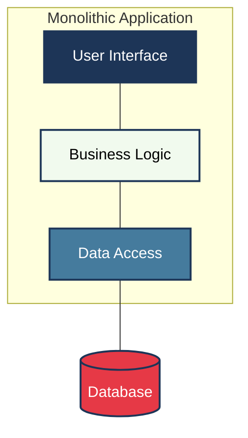
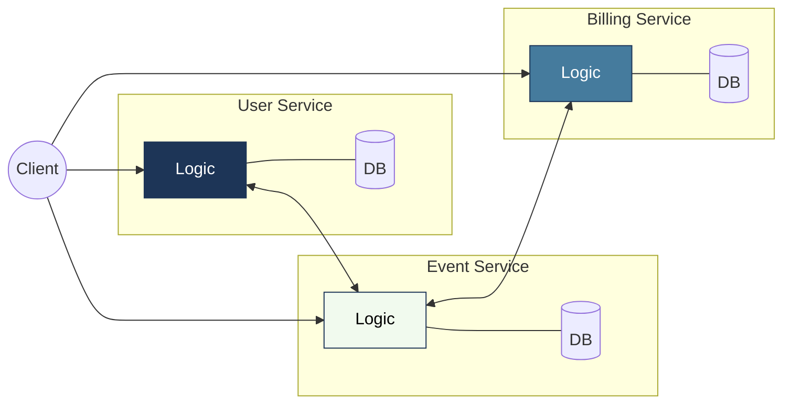
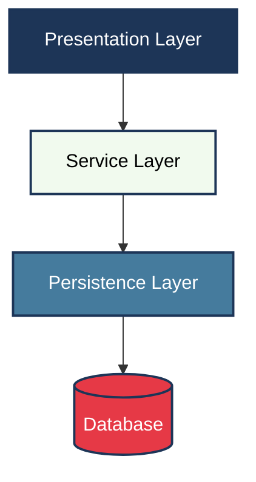
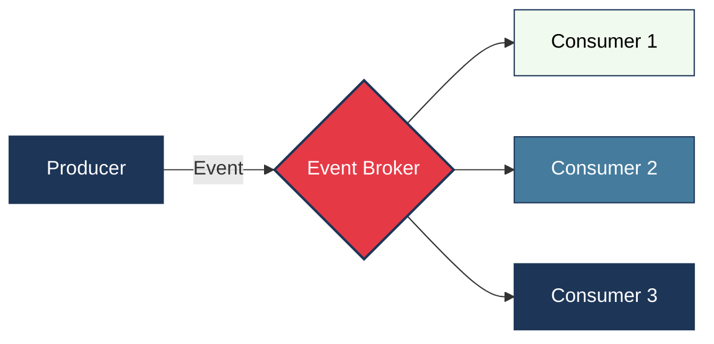
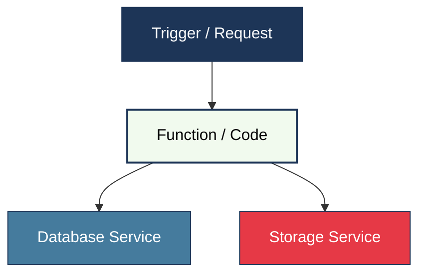
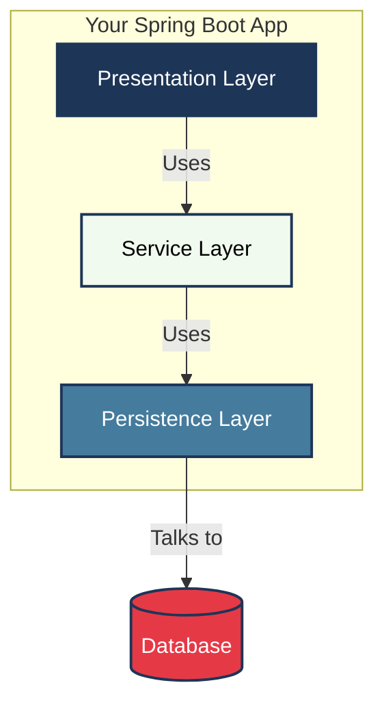
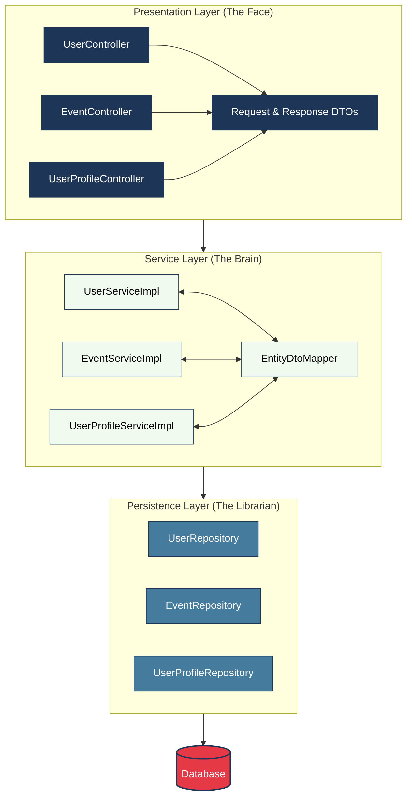

# Application Layers

## Table of Contents

1. [Software Architectures Overview](#software-architectures-overview)
2. [Multilayered Architecture](#multilayered-architecture)
3. [The Service Layer (The "Brain")](#the-service-layer-the-brain)
4. [Data Transfer Objects (DTOs) & Java Records](#data-transfer-objects-dtos--java-records)
5. [The Event Application](#the-event-application)

---

## Software Architectures Overview

**Software Architecture** is the fundamental organization of a system. Think of it as the **Master Blueprint** for a
complex building. While a single room's design (code) is important, the architecture ensures that the plumbing,
electricity, and structure all work together to keep the building standing and functional.

It defines:

- **The Components:** What are the different parts of the system?
- **The Communication:** How do these parts talk to each other?
- **The Organization:** How is everything structured to be reliable, easy to fix, and ready to grow?

Here are a few common ways we organize software:

### 1. Monolithic Architecture (The "All-in-One" House)

Everything is built into a single, big block of code. The database, the user interface, and all the business logic are
packaged together.



- **What it is:** Like a small house where everything is in one room. If you want to move the kitchen, you have to
  change the whole floor plan.
- **Use Case:** Great for a **Startup's Minimum Viable Product (MVP)** or a simple **Internal Blog**. Since it's all in
  one place, it's fast to build and easy to deploy on a single server.
- **Challenges:** As the app grows, it becomes a "Big Ball of Mud." If one tiny part breaks, the entire application
  might crash. Scaling is also hard—you have to copy the *entire* house even if you only need a bigger kitchen.

### 2. Microservices Architecture (The "Food Court")

The application is broken down into many tiny, independent services that talk to each other over the network.



- **What it is:** Like a food court. One shop only makes pizza, another only makes sushi, and another only sells drinks.
  If the sushi shop runs out of fish, the pizza shop can still serve customers.
- **Use Case:** Large-scale platforms like **Netflix** or **Amazon**. They have thousands of services (one for
  recommendations, one for billing, one for user profiles). This allows different teams to work on different parts
  without stepping on each other's toes.
- **Challenges:** It adds a lot of "overhead." You now have to manage many different databases, network connections, and
  security for every single service.

### 3. Layered (Multilayered) Architecture (The "Well-Run Restaurant")

Instead of breaking things by "what" they do (like pizza vs. sushi), we break them by **"how"** they process data. This
is the **Gold Standard** for many Spring Boot applications.



- **What it is:** A professional restaurant. You have the **Waitstaff** (Presentation) taking orders, the **Kitchen
  Staff** (Service) cooking, and the **Pantry** (Persistence) holding ingredients. Each person has a clear job and a
  specific place to work.
- **Use Case:** Most **Enterprise Business Applications** (like an Event Management System). It keeps the code clean,
  organized, and very easy to test. This is what we are using in this project!

### 4. Event-Driven Architecture (The "Announcement System")

In this setup, different parts of the system react to "Events" (things that just happened).



- **What it is:** Like a stadium announcer. When a goal is scored (the Event), the scoreboard updates, the fans cheer,
  and the news reporters write a story. The player who scored doesn't tell everyone individually—they just score, and
  everyone else reacts.
- **Use Case:** **Real-time Notifications** (like getting a push notification when someone likes your photo) or **Stock
  Market Apps** where prices need to update instantly across many screens.

### 5. Serverless Architecture (The "Personal Chef")

You don't worry about servers at all. You just write your code (Functions) and the cloud provider runs it only when it's
needed.



- **What it is:** Like hiring a personal chef only when you are hungry. You don't own a kitchen, you don't pay for
  electricity, and you don't clean up. You just say "I want pasta," the chef appears, cooks, and leaves. You only pay
  for the meal.
- **Use Case:** **Image Processing** (like automatically creating a thumbnail when a user uploads a profile picture) or
  **Scheduled Tasks** (like sending out a weekly email newsletter every Monday morning).

**This is the architecture we will focus on today!**

---

## Multilayered Architecture

Spring Boot applications are commonly structured into vertical layers, each with a distinct and isolated responsibility.
This architectural pattern, known as **"Layered Architecture"** or **"Multilayered Architecture"**, ensures that the
codebase remains organized, manageable, and easy to extend.

### The Core Principle: One-Way Traffic

The most important rule is that communication only happens in **one direction**:
`Presentation` -> `Service` -> `Persistence` -> `Database`

A layer can only talk to the one directly below it. The "Librarian" (Persistence) never talks to the "Waitstaff" (
Presentation) directly.



### 1. Presentation Layer (The "Face")

This is the entry point of your application. It handles all incoming requests (orders).

- **In Spring Boot:** This is where your `@RestController` classes live.
- **Responsibilities:**
    - **Receiving Requests:** Taking in JSON data via HTTP (POST, GET, etc.).
    - **Validation:** Checking if the data makes sense (e.g., "Is the email formatted correctly?").
    - **Sending Responses:** Returning the correct status codes (like `201 Created` or `400 Bad Request`).
- **Key Files:** `UserController.java`, `EventController.java`.

### 2. Service Layer (The "Brain")

This is where the actual "work" happens. It coordinates the logic of your application.

- **In Spring Boot:** This is where your `@Service` classes live.
- **Responsibilities:**
    - **Business Rules:** Checking things like "Does this user already exist?" or "Is this venue available?".
    - **Transactions:** Ensuring that if a complex task fails halfway, everything is rolled back (using
      `@Transactional`).
    - **Coordination:** Asking the Persistence layer for data, and the Mapper to translate it.
- **Key Files:** `UserServiceImpl.java`, `EventServiceImpl.java`.

### 3. Persistence Layer (The "Librarian")

This layer is responsible for retrieving and storing data. It doesn't care about business rules; it just manages the "
records".

- **In Spring Boot:** This is where your `@Repository` interfaces live.
- **Responsibilities:**
    - **Database Access:** Running queries to find, save, or delete data.
    - **Entity Management:** Mapping the database rows to Java objects called **Entities**.
- **Key Files:** `UserRepository.java`, `EventRepository.java`.

### 4. Database Layer (The "Bookshelf")

The physical place where your data lives (MySQL, H2, PostgreSQL).

---

## The Service Layer (The "Brain")

### Why do we need a separate Service Layer?

The **Service Layer** acts as the central hub of an application. While it might seem easier to put all logic inside a
Controller, a separate Service Layer provides several key advantages:

- **Reusability:** The same logic can be used by different controllers (e.g., a Web Controller and a REST Controller).
- **Isolation:** The "Brain" doesn't need to know if the request came from a mobile app or a website. It only cares
  about the rules.
- **Testability:** Business rules can be tested independently without starting a web server or a database.
- **Clarity:** Keeping the "Face" (Controller) thin and the "Brain" (Service) focused makes the code much easier to read
  and maintain.

### Interfaces vs. Implementations

In professional Spring Boot development, a Service is typically split into two parts:

1. **The Interface (The "What"):** Defines the available operations without saying *how* they work.
    - *Example:* `UserService.java` defines a `register()` method.
2. **The Implementation (The "How"):** Contains the actual code and logic.
    - *Example:* `UserServiceImpl.java` implements the `register()` method.

**Why do this?** This separation allows for "Loose Coupling." If the implementation needs to change (e.g., switching
from one email provider to another), the rest of the application remains untouched because it only depends on the
interface.

### The @Service Annotation

The `@Service` annotation tells Spring that a class is a **Service Component**.

- When the application starts, Spring scans for this annotation and creates an instance of the class (a "Bean").
- This allows other parts of the app (like the Controller) to "ask" for the service using **Dependency Injection**.
- It also makes the class eligible for advanced features like transaction management.

### Business Logic & Validation

This is where the application's unique "recipes" are stored. While the Controller handles simple data format checks, the
Service Layer handles **Business Rules**:

- **Verification:** "Does this email already exist in our system?"
- **Complex Rules:** "An event cannot be scheduled in the past."
- **Calculations:** "Calculate the total price for 5 tickets including a 10% discount."
- **Security Checks:** "Does this user have permission to cancel this event?"

### Managing Transactions (@Transactional)

One of the most critical jobs of the Service Layer is managing **Transactions**.

A transaction ensures that a series of steps are treated as a single "all-or-nothing" operation. Using the
`@Transactional` annotation:

- If all steps succeed, the changes are saved to the database (Commit).
- If any step fails (e.g., an error occurs halfway), all previous steps are undone (Rollback).

*Example:* When creating an event and adding the creator as a participant, both steps must succeed. If the participant
cannot be added, the event should not be created at all.

### Coordination: Mappers & Repositories

The Service Layer acts as a "Conductor," coordinating between different specialists:

1. **Mappers (The Translators):** The Service asks the `EntityDtoMapper` to convert incoming "Shipping Boxes" (DTOs)
   into "Ingredients" (Entities).
2. **Repositories (The Librarians):** The Service tells the `UserRepository` or `EventRepository` to find or save data.
3. **Mappers Again:** Before sending a result back, the Service asks the Mapper to translate the "Finished Meal" (
   Entity) into a "Receipt Box" (Response DTO).

### Handling Business Exceptions

When a rule is broken, the Service Layer "raises its hand" by throwing a **Business Exception**.

- Instead of returning `null` or a generic error, the Service throws specific exceptions like `DataNotFoundException` or
  `DuplicateEntryException`.
- This provides clear feedback about what went wrong (e.g., "User not found with ID: 5").
- The Presentation Layer can then catch these exceptions and translate them into a helpful message and the correct HTTP
  status code for the user.

---

## Data Transfer Objects (DTOs) & Java Records

### What are DTOs?

**DTO** stands for **Data Transfer Object**. Think of it as a **Shipping Box**.

When you order something online, the item isn't just thrown into the mail truck; it's placed in a sturdy box designed
for transport. In Spring Boot, a DTO is that box. It carries data between the "Face" (API) and the "Brain" (Service).

**Why use DTOs?**

- **Security:** We don't want to expose our internal database structure (Entities) to the outside world. DTOs allow us
  to share only what is necessary.
- **Decoupling:** If we change our database table, our API doesn't have to break as long as our DTO remains the same.
- **Performance:** A DTO can combine data from multiple entities or skip unnecessary fields, making the response smaller
  and faster.

### Why use Java Records for DTOs?

In modern Spring Boot (Java 17+), we use **Records** to create DTOs. A Record is a special type of class that is perfect
for holding data.

- **Immutability:** Once a Record is created, its data cannot be changed. This makes our data flow safer and more
  predictable.
- **No Boilerplate:** You don't need to write getters, constructors, `equals()`, `hashCode()`, or `toString()`. Java
  does it all for you in one line!
- **Concise:** Instead of 50 lines of code, a DTO can be defined in a single line.

*Example:*

```java
public record UserResponseDTO(Long id, String email, String fullName) {
}
```

### Validation on Records

Records work perfectly with **Jakarta Bean Validation**. We can put "Rules" directly on the record components to ensure
the data is valid before it even reaches our logic.

- `@NotBlank`: Ensures a text field isn't empty.
- `@Email`: Checks for a valid email format.
- `@Size(min=2, max=50)`: Limits the length of a string.
- `@Positive`: Ensures a number is greater than zero.

### DTOs vs. Entities

It's important to understand the difference between these two:

| Feature        | DTO (Shipping Box)                  | Entity (Ingredient)                                  |
|:---------------|:------------------------------------|:-----------------------------------------------------|
| **Purpose**    | Transporting data to/from the user. | Storing data in the database.                        |
| **Location**   | Presentation & Service Layers.      | Persistence & Service Layers.                        |
| **Mutability** | Usually Immutable (Records).        | Mutable (Regular Classes for JPA).                   |
| **Validation** | Format & Presence (e.g., `@Email`). | Database Constraints (e.g., `@Column(unique=true)`). |

**The Mapper's Job:** The `EntityDtoMapper` acts as the **Translator** that moves data between these two worlds.

---

## The Event Application

To tie everything together, here is a visual representation of the **Event Application** we have implemented. This diagram shows how the specific classes in each layer work together to handle users, their profiles, and the events they create.



- **Separation:** Notice how the `UserController` never talks to the `UserRepository` directly. It always goes through the `UserService`.
- **Coordination:** The `EventServiceImpl` is the most complex "Brain" because it coordinates between the `EventRepository` (to save the event), the `UserRepository` (to find the creator), and the `EntityDtoMapper` (to translate the data).
- **Data Safety:** The Database only knows about **Entities**, while the outside world only knows about **DTOs**. The **Service Layer** ensures they are never mixed up.


