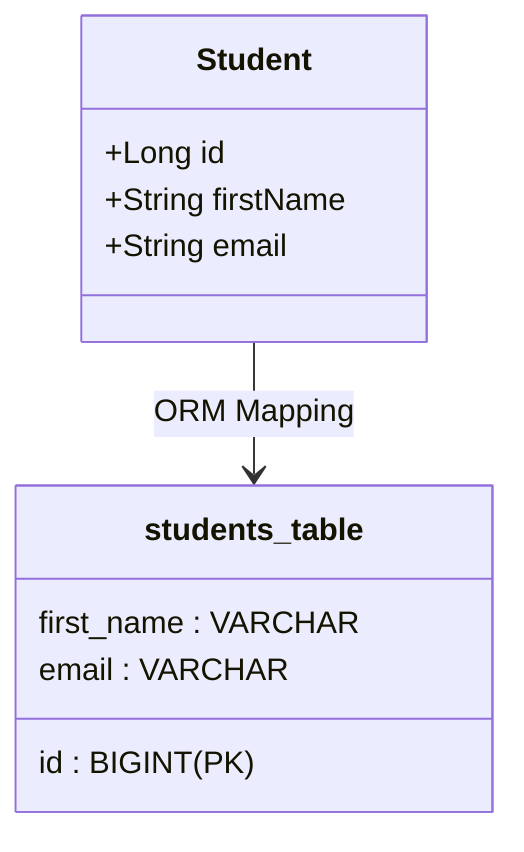

# Spring Boot & Spring Data JPA

## Table of Contents

- [1 – Spring Boot Fundamentals](#1--spring-boot-fundamentals)
- [2 – Database & JPA Basics](#2-database--jpa-basics)
- [3 – Spring Data JPA](#3--spring-data-jpa)
- [4 – Entity Relationships](#4--entity-relationships)
    - [4.1 One-to-One Mapping](#41-one-to-one-mapping)
    - [4.2 One-to-Many Mapping](#42-one-to-many-mapping)
    - [4.3 Many-to-One Mapping](#43-many-to-one-mapping)
    - [4.4 Many-to-Many Mapping](#44-many-to-many-mapping)
    - [4.5 Fetch Types (Lazy & Eager)](#45-fetch-types-lazy--eager)
    - [4.6 Cascade Types](#46-cascade-types)
    - [4.7 Orphan Removal](#47-orphan-removal)
- [5 – OPTIONAL: Advanced JPA](#5--optional-advanced-jpa)
    - [5.1 Transactions & @Transactional](#51-transactions--transactional)
    - [5.2 Projections](#52-projections)
    - [5.3 DTO Mapping](#53-dto-mapping)
    - [5.4 Auditing](#54-auditing)
    - [5.5 Optimistic & Pessimistic Locking](#55-optimistic--pessimistic-locking)
- [6 – OPTIONAL: Testing](#6--optional-testing)
    - [6.1 Unit Testing with JUnit](#61-unit-testing-with-junit)
    - [6.2 Repository Testing](#63-repository-testing)

---

## 1 – Spring Boot Fundamentals

### 1.1 What is Spring Boot?


Spring Boot is a framework that makes it **easy and fast** to build Java applications using Spring.

Instead of spending a lot of time on configuration, Spring Boot gives you **ready-to-use defaults**, so you can focus on writing business logic.

In simple words:
> **Spring Boot helps you create Spring applications with less setup and less configuration.**

Spring Boot follows the idea of **"Opinionated Configuration"**, which means:
> Spring Boot chooses sensible default settings for you, but you can change them whenever you want.


**Key Benefits:**

- **Auto-configuration**  
  Automatically configures Spring and third-party libraries based on what you add to your project.
- **Embedded Servers**  
  No need to install a server separately. Spring Boot comes with Tomcat, Jetty, or Undertow built in.
- **Starter Dependencies**  
  One dependency can bring everything you need for a feature (web, JPA, security, etc.).
- **Production-ready Features**  
  Built-in support for logging, health checks, and monitoring.
> **Spring Boot = Spring + smart defaults + less configuration + faster development**

### 1.2 Spring Boot vs Spring Framework

Think of the relationship like this: **Spring Framework is the engine, and Spring Boot is the car built around it.**


The **Spring Framework** provides the core infrastructure for Java applications (like Dependency Injection and IoC). It
is powerful but requires a lot of manual work to set up.

**Spring Boot** is not a replacement for Spring. It is a tool built on top of it that makes it faster and easier to use.
It handles the "boring" configuration parts for you automatically.
---

#### Why do we need Spring Boot?

Before Spring Boot, creating enterprise applications was challenging and time-consuming.
Developers had to:

- Manually connect web, database, and security layers
- Download dependencies manually & Find compatible library versions
- Configure server (Tomcat) yourself
- Write large amounts of configuration
- Write a lot of XML or Java configuration
- Fix version conflicts

Spring Boot follows an **opinionated approach**, meaning it makes smart default choices for you.

- Automatically sets up features based on dependencies
- Includes an embedded server
- Lets you start the app with one click

> You focus on **business logic**, not configuration.

| Feature           | Spring Framework (Core)         | Spring Boot (Extension)         |
|:------------------|:--------------------------------|:--------------------------------|
| **Main Goal**     | Provide core features (DI, IoC) | Simplify & speed up development |
| **Configuration** | Manual (XML or Java)            | Automatic (Auto-configuration)  |
| **Server**        | Must be installed separately    | Built-in (Embedded Tomcat)      |
| **Ease of Use**   | Higher learning curve           | Beginner-friendly               |
| **Output**        | Usually a WAR file              | A standalone JAR file           |

### 1.3 Creating First Spring Boot Project

The easiest way to start is via [Spring Initializr](https://start.spring.io/):

1. **Project:** Maven or Gradle.
2. **Language:** Java.
3. **Spring Boot Version:** Use the latest stable version.
4. **Project Metadata:** Group, Artifact, Name, Description, Package name.
5. **Java Version:** 25 (Recommended).
6. **Dependencies:** Add `Spring Web`, `Spring Data JPA`, `MySQL Database`, `H2 Database`, etc.
7. Click **Generate** to download the ZIP, then extract and open it in your IDE (IntelliJ, Eclipse, VS Code).

**Alternative: Creating a Project using IntelliJ IDEA Ultimate**

IntelliJ IDEA Ultimate has a built-in Spring Initializr integration:

1. Open IntelliJ IDEA Ultimate.
2. Click **File** > **New** > **Project**.
3. Select **Spring Initializr** from the left sidebar.
4. Configure the following:
  - **Project SDK:** Choose Java 25 (or your preferred version).
  - **Spring Initializr Service URL:** Leave as default (`https://start.spring.io`).
5. Click **Next** and fill in:
  - **Project Metadata:** Group, Artifact, Name, Description, Package name.
  - **Type:** Maven or Gradle.
  - **Language:** Java.
  - **Packaging:** Jar.
  - **Java Version:** 25 (Recommended).
6. Click **Next** and select **Dependencies**:
  - Add `Spring Web`, `Spring Data JPA`, `MySQL Driver`, `H2 Database`, etc.
7. Click **Create** to generate the project directly in IntelliJ IDEA.

### 1.4 Project Structure Explained

A typical Spring Boot project follows this structure:

- `src/main/java`: Contains the main Java source code.
    - `...application.java`: The entry point (Main class with `@SpringBootApplication`).
- `src/main/resources`:
    - `static/`: For static assets (HTML, CSS, JS).
    - `templates/`: For server-side templates (Thymeleaf).
    - `application.properties` / `yml`: Configuration files.
- `src/test/java`: Contains unit and integration tests.
- `pom.xml` (Maven) or `build.gradle`: Manages dependencies and build settings.

### 1.5 Spring Boot Starters

Spring Boot Starters are **predefined dependency bundles** that group together everything needed to support a specific feature in a Spring Boot application.

Instead of searching for individual libraries and managing compatible versions yourself, you simply add **one starter dependency**, and Spring Boot automatically includes all the required components behind the scenes.

This approach:

- Reduces configuration and setup time
- Prevents version conflicts between libraries
- Keeps the `pom.xml` or `build.gradle` file clean and readable
- Ensures that all included libraries work well together

For example:

- `spring-boot-starter-web` includes Spring MVC, embedded Tomcat, JSON processing, and validation.
- `spring-boot-starter-data-jpa` includes Hibernate, Spring Data JPA, and database integration.
- `spring-boot-starter-test` includes JUnit, Mockito, and Spring Test utilities.

In short, **Starters allow you to enable complex functionality by adding a single dependency**, so you can focus on building application logic instead of assembling libraries.`

### 1.6 application.properties & application.yml

Used to configure application-specific settings like database connections, server ports, and logging.

- **Properties format:** `server.port=8080`
- **YAML format:**
  ```yaml
  server:
    port: 8080
  ```

### 1.7 Auto Configuration

**Auto Configuration** is one of Spring Boot’s core features.  
It automatically configures your application based on:

- The **dependencies** present on the classpath
- The **existing configuration** in `application.properties` / `application.yml`
- Sensible **default settings**

Instead of manually defining dozens of beans, Spring Boot *intelligently guesses* what you need and sets it up for you.

---

#### How Auto Configuration Works

At startup, Spring Boot:

1. Scans the **classpath** (your Maven/Gradle dependencies)
   - **classpath**: Where Java looks to find your code and libraries.
2. Checks for **known libraries** (Web, JPA, Security, DataSource, etc.)
3. Applies matching **auto-configuration classes**
4. Backs off if you already defined your own configuration

> **“If Spring Boot sees a dependency, it tries to configure it automatically.”**

#### 🔹 Example 1: MySQL Auto Configuration

Add the MySQL driver dependency:

```xml
<dependency>
    <groupId>com.mysql</groupId>
    <artifactId>mysql-connector-j</artifactId>
</dependency>
```
Add database settings in application.properties:
```properties
spring.datasource.url=jdbc:mysql://localhost:3306/school_db
spring.datasource.username=root
spring.datasource.password=1234

spring.jpa.hibernate.ddl-auto=update
spring.jpa.show-sql=true

```
**What Spring Boot does automatically:**

- Detects MySQL driver on the classpath
- Creates a `DataSource` bean
- Configures Hibernate
- Creates `EntityManagerFactory`
- Enables transaction management

You do **not** need to write any configuration classes.

### 1.8 Running Spring Boot Application

1. **From IDE:** Right-click the class with `@SpringBootApplication` and select "Run".
2. **From Terminal (Maven):** `mvn spring-boot:run`
3. **From JAR:**
   ```bash
   mvn clean package
   java -jar target/your-app-name.jar
   ```

---

## 2 Database & JPA Basics

### 2.1 What is ORM?

**Object-Relational Mapping (ORM)** is a technique that lets you query and manipulate data from a database using an object-oriented paradigm.

- **The Problem:** Java uses **Objects** (classes, fields, inheritance), while Relational Databases use **Tables** (rows, columns, foreign keys). These two systems don't naturally "talk" to each other.
- **The Solution:** ORM acts as a bridge. It maps Java classes to Database tables and Java properties to Table columns.

**Benefits of ORM:**
- **No SQL Required (mostly):** You can perform CRUD operations using Java methods.
- **Maintainability:** Code is cleaner and easier to manage.
- **Database Independence:** You can switch databases (e.g., from H2 to MySQL) with minimal code changes.



### 2.2 Introduction to JPA

**Jakarta Persistence API (JPA)** (formerly Java Persistence API) is a **specification** (a set of rules and interfaces) for ORM in Java.

- It is **not** a tool or a library itself. It is a document that describes how to manage relational data in Java applications.
- It provides a standard way to map Java objects to database tables.
- Since it's a specification, you need an **implementation** (like Hibernate) to actually use it.

### 2.3 JPA vs Hibernate

Think of it like this: **JPA is the Interface, and Hibernate is the Implementation.**

| Feature                   | JPA (Specification)              | Hibernate (Implementation)               |
|:--------------------------|:---------------------------------|:-----------------------------------------|
| **What is it?**           | A set of guidelines/rules.       | A framework that follows the rules.      |
| **Analogy**               | A recipe for a cake.             | The actual cake made using that recipe.  |
| **Standard**              | Part of the Jakarta EE standard. | A third-party library.                   |
| **Can you use it alone?** | No, it needs an implementation.  | Yes, it can be used with or without JPA. |

> **Tip:** Always recommend using JPA annotations (`jakarta.persistence.*`) instead of Hibernate-specific ones. This makes your application "portable" and easier to switch to other JPA providers if needed.

### 2.4 Entities & Tables

In JPA, an **Entity** is a lightweight domain object that represents a row in a database table.

**Key Annotations:**
- `@Entity`: Marks the class as a JPA entity (mapped to a table).
- `@Table`: (Optional) Specifies the table name in the database.
- `@Id`: Marks the field that serves as the Primary Key.
- `@Column`: (Optional) Customizes the column mapping (name, length, nullability).

**Example:**
```java
@Entity
@Table(name = "students")
public class Student {
    @Id
    private Long id;
    
    @Column(name = "first_name", nullable = false)
    private String firstName;
    
    private String email; // Automatically mapped to a column named 'email'
}
```

### 2.5 Primary Key Strategies

JPA uses the `@GeneratedValue` annotation to define how the primary key should be created.

1.  **IDENTITY**: The database handles the increment (e.g., `AUTO_INCREMENT` in MySQL).
2.  **SEQUENCE**: Uses a database sequence object (common in Oracle and PostgreSQL).
3.  **TABLE**: Uses a separate table to keep track of the next ID (rarely used now).
4.  **AUTO**: The default. JPA chooses the best strategy based on the database dialect.

**Example:**
```java
@Id
@GeneratedValue(strategy = GenerationType.IDENTITY)
private Long id;
```

### 2.6 Entity Lifecycle

An entity can be in one of four states during its life:

1.  **New (Transient)**: The object is created (`new Student()`) but not yet associated with a database row or a JPA Session.
2.  **Managed (Persistent)**: The object is associated with a JPA session. Changes to the object will be automatically saved to the database.
3.  **Detached**: The object exists in the database, but the JPA session is closed. Changes won't be tracked.
4.  **Removed**: The object is marked for deletion from the database.

---

## 3 – Spring Data JPA

### 3.1 What is Spring Data JPA?

**Spring Data JPA** is a part of the larger Spring Data family. It makes it easy to implement JPA-based repositories. It adds a layer of abstraction on top of the JPA provider (like Hibernate).

- **The Problem:** Even with JPA, you still have to write a lot of repetitive "boilerplate" code for every entity (save, findById, delete, etc.).
- **The Solution:** Spring Data JPA allows you to create repository interfaces. You don't need to write the implementation! Spring Data JPA creates it for you at runtime.

### 3.2 Repository Pattern

The **Repository Pattern** is a design pattern that separates the logic that retrieves data from the business logic that acts on that data.

- **Centralized Data Access:** All database operations for a specific entity are in one place.
- **Decoupling:** Your business logic doesn't need to know how the data is stored or retrieved.
- **Easier Testing:** You can easily mock repositories for unit testing.

### 3.3 CrudRepository vs JpaRepository

Spring Data JPA provides several interfaces that you can extend. The most common are:

1.  **CrudRepository**: Provides basic CRUD (Create, Read, Update, Delete) operations.
2.  **PagingAndSortingRepository**: Extends `CrudRepository` and adds methods for pagination and sorting.
3.  **JpaRepository**: Extends `PagingAndSortingRepository`. It provides JPA-specific methods (like `flush()` to send changes to the DB immediately and `deleteInBatch()`).

> **Tip:** In most Spring Boot projects, we use **JpaRepository** because it offers the most features.

### 3.4 Creating Repository Interfaces

To create a repository, you just need to define an interface that extends `JpaRepository`.

**Example:**
```java
public interface StudentRepository extends JpaRepository<Student, Long> {
    // No code needed! Basic CRUD methods are already included.
}
```
- `Student`: The entity type.
- `Long`: The type of the Primary Key (`@Id`).

### 3.5 Derived Query Methods

One of the coolest features! You can define query methods simply by naming them according to a specific convention. Spring Data JPA parses the method name and generates the SQL automatically.

**Examples:**
```java
// findBy + PropertyName
List<Student> findByFirstName(String name);

// findBy + PropertyName + Keyword + PropertyName
List<Student> findByFirstNameAndEmail(String name, String email);

// findBy + PropertyName + Comparison
List<Student> findByAgeGreaterThan(int age);

// findBy + PropertyName + Containing (Like)
List<Student> findByEmailContaining(String keyword);
```

### 3.6 Custom JPQL Queries

If a query is too complex for a method name, you can use the `@Query` annotation with **JPQL** (Java Persistence Query Language). JPQL works with Java objects and fields rather than table names and columns.

**Example:**
```java
@Query("SELECT s FROM Student s WHERE s.email LIKE %:suffix")
List<Student> findStudentsWithEmailEndingWith(@Param("suffix") String suffix);
```

### 3.7 Native Queries

Sometimes you need to use features specific to a certain database (like MySQL or PostgreSQL). You can write **Native SQL** queries using the same `@Query` annotation.

**Example:**
```java
@Query(value = "SELECT * FROM students WHERE created_at > NOW() - INTERVAL 1 DAY", nativeQuery = true)
List<Student> findNewStudentsNative();
```

### 3.8 Paging & Sorting

Spring Data JPA makes it very easy to handle large amounts of data using the `Pageable` and `Sort` interfaces.

**Sorting Example:**
```java
List<Student> students = repository.findAll(Sort.by("firstName").ascending());
```

**Paging Example:**
```java
Pageable pageable = PageRequest.of(0, 10, Sort.by("email"));
Page<Student> studentPage = repository.findAll(pageable);

List<Student> content = studentPage.getContent(); // The actual data
long totalElements = studentPage.getTotalElements(); // Total rows in DB
```

---

## 4 – Entity Relationships

In the real world, data is related. A student has an address, a course has many students, and an instructor teaches several courses. JPA allows us to map these relationships using annotations.

### 4.1 One-to-One Mapping

Used when one entity is associated with exactly one other entity.

- **Example:** A `Student` has one `Address`.
- **Annotation:** `@OneToOne`

```java
@Entity
public class Student {
    @Id
    @GeneratedValue(strategy = GenerationType.IDENTITY)
    private Long id;

    @OneToOne(cascade = CascadeType.ALL)
    @JoinColumn(name = "address_id", referencedColumnName = "id")
    private Address address;
}
```

### 4.2 One-to-Many Mapping

Used when one entity is associated with multiple instances of another entity.

- **Example:** One `Category` has many `Products`.
- **Annotation:** `@OneToMany`
- Usually used with `mappedBy` to make the relationship bidirectional.

### 4.3 Many-to-One Mapping

The most common relationship. Multiple instances of an entity are associated with one instance of another entity.

- **Example:** Many `Students` belong to one `Classroom`.
- **Annotation:** `@ManyToOne`

```java
@Entity
public class Student {
    @ManyToOne
    @JoinColumn(name = "classroom_id")
    private Classroom classroom;
}
```

### 4.4 Many-to-Many Mapping

Used when multiple instances of an entity are associated with multiple instances of another entity. This requires a **Join Table**.

- **Example:** Many `Students` enroll in many `Courses`.
- **Annotation:** `@ManyToMany`

```java
@Entity
public class Student {
    @ManyToMany
    @JoinTable(
        name = "student_courses",
        joinColumns = @JoinColumn(name = "student_id"),
        inverseJoinColumns = @JoinColumn(name = "course_id")
    )
    private Set<Course> courses;
}
```

### 4.5 Fetch Types (Lazy & Eager)

This defines **when** the related data should be loaded from the database.

1.  **EAGER**: The related data is loaded immediately along with the main entity.
    - Default for: `@OneToOne`, `@ManyToOne`.
2.  **LAZY**: The related data is loaded only when you actually call the getter method (e.g., `student.getAddress()`).
    - Default for: `@OneToMany`, `@ManyToMany`.
    - **Recommendation:** Use LAZY as much as possible to improve performance.

### 4.6 Cascade Types

Cascading allows you to propagate operations (like save or delete) from a parent entity to its children.

- `PERSIST`: Saving the parent also saves the child.
- `REMOVE`: Deleting the parent also deletes the child.
- `ALL`: Applies all cascade operations.

### 4.7 Orphan Removal

A JPA-specific feature (`orphanRemoval = true`). If a child entity is removed from the parent's collection, it is automatically deleted from the database.

> **Tip:** Be careful with `CascadeType.REMOVE` and `orphanRemoval`. They are powerful but can lead to accidental data loss if not used correctly!

---

## 5 – Advanced JPA

### 5.1 Transactions & @Transactional

A **Transaction** is a unit of work that should either succeed completely or fail completely. Spring uses the `@Transactional` annotation to manage this.

- **ACID Properties:** Atomic, Consistent, Isolated, Durable.
- **Rollback:** By default, Spring rolls back the transaction if a **RuntimeExpression** (unchecked) occurs.
- **Usage:** You can apply it to a class or a specific method (usually in the Service layer).

```java
@Service
public class StudentService {
    @Transactional
    public void enrollStudent(Student student, Course course) {
        // If any step fails, everything is rolled back
        studentRepository.save(student);
        courseRepository.addStudent(course, student);
    }
}
```

### 5.2 Projections

Sometimes you don't need all the columns of an entity. **Projections** allow you to fetch only specific data, which improves performance.

- **Interface-based Projection:** Define an interface with getter methods.

```java
public interface StudentNameView {
    String getFirstName();
    String getLastName();
}

// In Repository
List<StudentNameView> findByEmail(String email);
```

### 5.3 DTO Mapping

**Data Transfer Objects (DTOs)** are objects used to carry data between layers (e.g., from the API to the Service). 

- **Why use DTOs?**
    - Hide internal database structure.
    - Reduce the size of the data sent over the network.
    - Avoid circular references in JSON.

- **How to map?** You can map manually, use a library like ModelMapper/MapStruct, or use Java **Records**.

```java
public record StudentDTO(String name, String email) {}

// Manual Mapping
StudentDTO dto = new StudentDTO(student.getName(), student.getEmail());
```

### 5.4 Auditing

JPA Auditing automatically tracks when an entity was created or modified and by whom.

**Common Annotations:**
- `@CreatedDate`: Stores the creation timestamp.
- `@LastModifiedDate`: Stores the last update timestamp.
- `@CreatedBy` / `@LastModifiedBy`: Stores the user who performed the action (requires Spring Security).

**Setup:**
1. Add `@EnableJpaAuditing` to a configuration class.
2. Add `@EntityListeners(AuditingEntityListener.class)` to your entity.

### 5.5 Optimistic & Pessimistic Locking

Used to handle **concurrency** when multiple users try to update the same data at the same time.

1.  **Optimistic Locking**: Assumes no conflict will happen. Uses a `@Version` column. If the version changes while you are editing, an exception is thrown.
    - **Annotation:** `@Version`
2.  **Pessimistic Locking**: Locks the database row so no one else can read or write until the transaction is finished.
    - **Annotation:** `@Lock(LockModeType.PESSIMISTIC_WRITE)`

---

## 6 – Testing

Testing is a crucial part of the development lifecycle. It ensures that your code works as expected and prevents regressions when you make changes.

### 6.1 Unit Testing with JUnit

**JUnit 5** is the standard testing framework for Java. A unit test focuses on a single "unit" of code (usually a method) in isolation.

- **Core Annotations:**
    - `@Test`: Marks a method as a test case.
    - `@BeforeEach`: Runs before every test method (used for setup).
    - `@AfterEach`: Runs after every test method (used for cleanup).
    - `@DisplayName`: Provides a custom name for the test.

- **Assertions:** Used to verify results.
    - `assertEquals(expected, actual)`
    - `assertTrue(condition)`
    - `assertThrows(Exception.class, () -> logic)`

### 6.2 Repository Testing

Spring Boot provides `@DataJpaTest` for testing the persistence layer.

- **Features:**
    - Configures an in-memory database (like H2).
    - Scans for `@Entity` classes and Spring Data Repositories.
    - **Transactional:** Tests are rolled back by default, so they don't affect the database.

```java
@DataJpaTest
class StudentRepositoryTest {
    @Autowired
    private StudentRepository repository;

    @Test
    void testSaveAndFind() {
        Student student = new Student("John", "john@example.com");
        repository.save(student);
        
        Optional<Student> found = repository.findByEmail("john@example.com");
        assertTrue(found.isPresent());
    }
}
```
