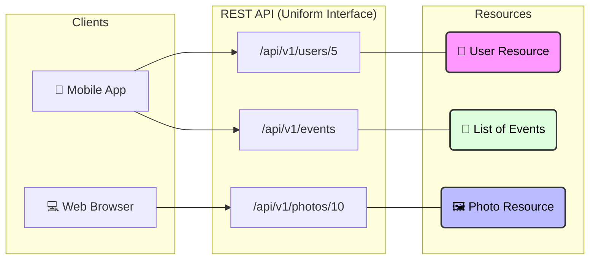
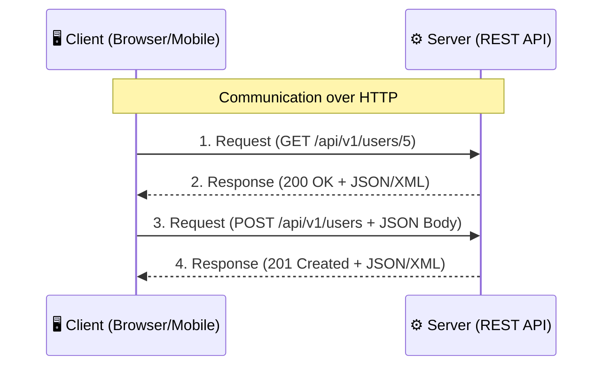

# Spring REST & Web APIs

## Table of Contents

- [1 – Introduction to REST](#1--introduction-to-rest)
- [2 – Spring REST Controllers](#2--spring-rest-controllers)
- [3 – Request Mapping & Parameters](#3--request-mapping--parameters)
- [4 – Request Body & Response Entity](#4--request-body--response-entity)
- [5 – REST Error Handling](#5--rest-error-handling)
- [6 – Swagger & OpenAPI Documentation](#6--swagger--openapi-documentation)
- [7 – CORS (Cross-Origin Resource Sharing)](#7--cors-cross-origin-resource-sharing)
- [8 – Content Negotiation (JSON vs XML)](#8--content-negotiation-json-vs-xml)
- [9 – REST Best Practices](#9--rest-best-practices)

---

## 1 – Introduction to REST

### 1.1 What is REST?

REST stands for **Representational State Transfer**.
It is an **architectural style** for designing networked applications. It's a set of **constraints** (guidelines) that,
when followed, allow systems to communicate over a network in a simple, scalable, and efficient way.

- **Architectural style**: A general way or pattern for designing software systems.
- **Constraints (guidelines)**: Rules that developers follow when building the system.
- If developers follow these REST rules, the system will work well for communication between client and server.

Think of REST as the "operating system" for the web. It relies on a stateless, client-server communications protocol —
almost always **HTTP**.

- **Resource-Centric:** Everything (users, products, orders) is a "resource" with its own unique address (URI).
- **Uses HTTP Standards:** It leverages existing HTTP methods (GET, POST, etc.) and status codes (200 OK, 404 Not
  Found).
- **Language Independent:** A Java backend can talk to a React frontend or a Python script via REST.

#### Breaking down the name:

* **Representational:** Resources (like a `User` or `Event`) can be represented in different formats, such as **JSON**,
  **XML**, or **HTML**. The client doesn't get the actual database record; it gets a *representation* of it.
* **State:** This refers to the data or the condition of a resource at a specific point in time.
* **Transfer:** The process of moving the representation of the resource's state from the server to the client (or vice
  versa) over the network.

In a RESTful system, everything is considered a **Resource**. A resource is any piece of information that can be named (
a user, a photo, a list of events). Each resource is identified by a unique **URI** (Uniform Resource Identifier), such
as `/api/v1/users/5`.



In simple words:
> **REST is a set of rules that allow different systems to talk to each other over the web using standard HTTP methods.
**

Why REST?

- **Simple & Familiar:** Built on HTTP — easy to learn and use with browsers, cURL, Postman, etc.
- **Scalable:** Stateless requests make horizontal scaling straightforward.
- **Decoupled:** Client and server evolve independently as long as the contract (API) stays the same.
- **Cache-Friendly:** GET responses can be cached to reduce load and latency.

### Core Principles of REST

1. **Client-Server**: Separation of concerns. The frontend (client) and backend (server) are independent.
    - **Separation of Concerns:** The client handles the user interface and user experience (the "look and feel"), while
      the server handles data storage, security, and business logic.
    - **Independence:** You can update the client (e.g., change from a web app to a mobile app) without changing the
      server, as long as the interface (API) remains the same. Similarly, you can change the server's database without
      affecting the client.
    - **Scalability:** Since they are separate, you can scale the server to handle more requests without needing to
      change anything on the client side.
2. **Stateless**: Each request from client to server must contain all the information necessary to understand and
   complete the request. The server does not store any session state or client data between requests.
    - Imagine a vending machine. You put in coins and press a button (the request). The machine doesn't care who you are
      or what you bought 5 minutes ago; it only cares about the current request.
    - This makes the system much easier to scale because any server can handle any request.
3. **Uniform Interface**: A consistent way for the client and server to communicate.
    - **Resource Identification:** Each resource is identified by a unique URI (e.g., `/api/v1/users/123`).
    - **Manipulation through Representations:** The client doesn't modify the database directly. Instead, it sends a
      representation (like JSON) using standard HTTP methods (**GET, POST, PUT, DELETE**) to request changes.
    - **Self-descriptive Messages:** Each request and response contains enough information for the receiver to
      understand it (e.g., the `Content-Type` header tells the client if the data is JSON or XML).
    - **HATEOAS (Hypermedia):** The server provides links to other related actions or resources, guiding the client on
      what it can do next.



### HTTP Methods

REST uses standard HTTP methods to perform actions on resources. Each method has a specific purpose and follows certain
rules:

| Method      | Action           | Description                                                                                                | Safe? | Idempotent? |
|:------------|:-----------------|:-----------------------------------------------------------------------------------------------------------|:------|:------------|
| **GET**     | Read             | **Why?** To fetch data without side effects. GET is cacheable and browser-friendly.                        | Yes   | Yes         |
| **POST**    | Create           | **Why?** To create new resources. POST can send large/sensitive data in the request body (not in the URL). | No    | No          |
| **PUT**     | Update (Full)    | **Why?** To completely replace an existing resource with a known ID.                                       | No    | Yes         |
| **PATCH**   | Update (Partial) | **Why?** To update specific fields (e.g., just an email) without resending the entire resource.            | No    | No          |
| **DELETE**  | Delete           | **Why?** To remove a resource entirely.                                                                    | No    | Yes         |
| **HEAD**    | Metadata         | **Why?** To check if a resource exists or check headers without downloading the full body.                 | Yes   | Yes         |
| **OPTIONS** | Capabilities     | **Why?** To discover which HTTP methods are supported by the server for a specific resource.               | Yes   | Yes         |

### Why specific methods for specific actions?

#### 1. Why GET for Retrieving?

- **Safety:** GET is "safe," meaning it only reads data and doesn't change anything on the server.
- **Idempotency:** You can call GET many times and get the same result (as long as the data hasn't changed).
- **Caching:** Browsers and servers can cache GET responses, making things much faster for users.
- **Bookmarking:** You can bookmark a GET URL (e.g., `google.com/search?q=rest`), but you can't bookmark a POST request.

#### 2. Why POST for Creating?

- **Body Content:** POST allows you to send a large amount of data in the **request body** (like a complex JSON object),
  whereas GET is limited by URL length.
- **Security:** POST keeps data out of the URL. Sensitive info like passwords shouldn't be in the URL (GET), where they
  show up in browser history and server logs.
- **Non-Idempotency:** Creating a resource usually generates a new ID. If you send the same POST request twice, you'll
  likely create two different records. POST is perfect for this "non-repeatable" action.

#### 3. Why PUT for Full Updates?

- **Semantics:** PUT is like "placing" a file. You provide the **entire** state of the resource.
- **Idempotency:** Sending the same PUT request 100 times will always result in the resource being in that **exact** same state.
- **Predictability:** Since it's a full replace, you always know exactly what the resource looks like after a PUT.

#### 4. Why PATCH for Partial Updates?

- **Efficiency:** You only send the fields you want to change (e.g., just the "email"), not the whole user object.
- **Bandwidth:** Saves data transfer, especially for large resources with many fields.
- **Non-Idempotency:** Unlike PUT (which replaces everything), repeating a PATCH might have different side effects depending on how the server implements the "partial" logic (e.g., appending to a list).
- **Difference from PUT:**
    - **PUT** = "Replace everything" (If you miss a field in PUT, it might be set to null).
    - **PATCH** = "Change only these specific things" (Fields not mentioned are left alone).

---

### HTTP Response Status Codes

The server uses standard HTTP response status codes to inform the client about the result of the request. These are
grouped into five categories:

#### 1. Informational (1xx)

The request was received, and the process is continuing.

- `100 Continue`

#### 2. Success (2xx)

The action was successfully received, understood, and accepted.

- `200 OK`: Standard response for successful GET, PUT, or PATCH requests.
- `201 Created`: The request has been fulfilled and resulted in a new resource being created (Commonly used with POST).
- `204 No Content`: The request was successful, but there's no additional content to send in the response body (Commonly
  used with DELETE).

#### 3. Redirection (3xx)

Further action needs to be taken by the client to complete the request.

- `301 Moved Permanently`: The resource has been moved to a new URI.
- `304 Not Modified`: Used for caching; tells the client the resource hasn't changed.

#### 4. Client Error (4xx)

The request contains bad syntax or cannot be fulfilled.

- `400 Bad Request`: The server could not understand the request (e.g., malformed JSON).
- `401 Unauthorized`: The client must authenticate itself to get the requested response.
- `403 Forbidden`: The client does not have access rights to the content.
- `404 Not Found`: The server cannot find the requested resource.
- `405 Method Not Allowed`: The method (e.g., POST) is not supported for the resource.

#### 5. Server Error (5xx)

The server failed to fulfill an apparently valid request.

- `500 Internal Server Error`: A generic error message when the server encounters an unexpected condition.
- `503 Service Unavailable`: The server is not ready to handle the request (e.g., maintenance or overload).

---

### RESTful API Guidelines

1. **Use Nouns, Not Verbs**: Resources should be nouns in the URI (e.g., `/api/users`, not `/api/getUsers`).
2. **Use Plural Nouns**: It's common practice to use plural nouns for collections (e.g., `/api/events`).
3. **Use Hierarchy in URIs**: URIs should reflect the relationship between resources (e.g., `/api/users/5/photos`).
4. **Consistency**: Use a consistent naming convention (camelCase or kebab-case).
5. **Versioning**: Include the version in the URI (e.g., `/api/v1/...`).
6. **Statelessness**: No client session data on the server.
7. **Meaningful Response Codes**: Always return the correct HTTP status code.

---

- **Safe Methods:** Methods that do not modify resources (like `GET`). They are read-only.
- **Idempotent Methods:** Methods that can be called multiple times with the same result (like `GET`, `PUT`, and
  `DELETE`). Calling `DELETE /users/1` ten times has the same effect as calling it once—the user is gone.
- **Request Body:** `POST`, `PUT`, and `PATCH` typically include data (JSON) in the request body, while `GET` and
  `DELETE` usually do not.

> **REST is the backbone of the modern web, serving as a universal "language" that allows diverse systems—from mobile
apps to large-scale microservices—to communicate reliably, efficiently, and independently.**

---

## 2 – Spring REST Controllers

### 2.1 @RestController Annotation

In Spring Boot, the `@RestController` annotation is the primary way to create **RESTful Web Services**.

Think of a Controller as the **"Traffic Cop"** or the **"Entry Point"** of your application. Its main job is to:

- **Listen for Requests:** It waits for specific HTTP requests (like `GET /api/users`) from a client.
- **Route the Request:** It identifies which method in your code should handle the incoming request.
- **Extract Data:** It pulls information from the request (like ID numbers in the URL or JSON data in the body).
- **Coordinate Logic:** It tells the **Service Layer** what to do (e.g., "Find the user with ID 5").
- **Send the Response:** It packages the results (data) and sends them back to the client with an appropriate HTTP
  status code.

#### What does @RestController do?

It is a shortcut that combines two important annotations:

1. **`@Controller`**: Tells Spring this class handles web requests.
2. **`@ResponseBody`**: Tells Spring to send data (like JSON) directly to the client instead of looking for an HTML
   page.

> **`@RestController` = `@Controller` + `@ResponseBody`**

#### Why use it?

* **Automatic JSON:** It automatically turns your Java objects into JSON.
* **Less Code:** You don't need to add `@ResponseBody` to every single method.
* **API Ready:** Perfect for building modern services that only send data.

### 2.2 Creating a Simple Controller

```java

@RestController
@RequestMapping("/api/v1/users")
//RequestMapping Defines the base URL for all methods in this controller
public class UserController {

    @GetMapping
    public List<UserResponseDTO> findAll() {
        return userService.findAll();
    }
}
```

#### What is @RequestMapping?

The `@RequestMapping` annotation at the class level defines the **base URL** for all the endpoints within that
controller. In the example above, all methods in `UserController` will start with `/api/v1/users`.

- **Base Path:** It helps group related actions under a common path.
- **Version Control:** It's common practice to include a version (like `v1`) in the path to manage API changes over
  time.
- **Method Level:** It can also be used on individual methods, but specific annotations like `@GetMapping` are preferred
  for clarity.

### 2.3 How it works

1. **Request**: The client sends an HTTP request (e.g., `GET /api/v1/users`).
2. **Mapping**: Spring MVC finds the controller and method mapped to that URL.
3. **Logic**: The method calls the service layer to get data.
4. **Serialization**: Spring automatically converts the Java object/list into JSON (using the Jackson library).
5. **Response**: The JSON is sent back to the client with an HTTP status code (default `200 OK`).

---

## 3 – Request Mapping & Parameters

### 3.1 Mapping Annotations

Spring provides specific annotations for each HTTP method:

- `@GetMapping`: For reading data.
- `@PostMapping`: For creating data.
- `@PutMapping`: For full updates.
- `@DeleteMapping`: For deletions.
- `@PatchMapping`: For partial updates.

### 3.2 Path Variables

Used to extract values from the URL path. Usually used for IDs.

**Example:** `GET /api/v1/events/5`

```java

@GetMapping("/{id}")
public ResponseEntity<EventResponseDTO> findById(@PathVariable Long id) {
    return eventService.findById(id)
            .map(ResponseEntity::ok)
            .orElse(ResponseEntity.notFound().build());
}
```

### 3.3 Request Parameters (Query Params)

Used for filtering, searching, or pagination. These appear after the `?` in the URL.

**Example:** `GET /api/v1/events/search/title?keyword=Spring`

```java

@GetMapping("/search/title")
public ResponseEntity<List<EventResponseDTO>> findByTitle(@RequestParam String keyword) {
    return ResponseEntity.ok(eventService.findByTitle(keyword));
}
```

---

## 4 – Request Body & Response Entity

### 4.1 @RequestBody & DTOs

The `@RequestBody` annotation is used to map the body of an HTTP request (usually JSON) to a Java object. In
professional projects, we **never** use Entities directly in controllers. Instead, we use **DTOs (Data Transfer Objects)
**.

#### Why use DTOs?

1. **Security:** Hide sensitive database fields (like passwords).
2. **Decoupling:** Change your database without breaking the API.
3. **Efficiency:** Send only the data the client needs.

#### Validation with @Valid

We use **Jakarta Validation** annotations to ensure the data coming from the client is correct before it reaches our
service.

**Example from `EventRequestDTO`:**

```java
public record EventRequestDTO(
        @NotBlank(message = "Title is required")
        String title,

        @NotNull(message = "Date is required")
        @FutureOrPresent(message = "Date cannot be in the past")
        LocalDateTime dateTime,

        Long createdByUserId
) {
}
```

**Controller Usage:**

```java

@PostMapping
public ResponseEntity<EventResponseDTO> create(@Valid @RequestBody EventRequestDTO eventDto) {
    // If validation fails, Spring automatically returns 400 Bad Request
    return ResponseEntity.status(HttpStatus.CREATED).body(eventService.create(eventDto));
}
```

### 4.2 ResponseEntity

The `ResponseEntity` class represents the entire HTTP response: **Status Code, Headers, and Body**.

It gives you full control over what the client receives.

**Common Status Codes:**

- `200 OK`: Successful request.
- `201 Created`: Successful creation (used for POST).
- `204 No Content`: Successful deletion or update with no body.
- `400 Bad Request`: Validation error or invalid input.
- `404 Not Found`: Resource does not exist.
- `500 Internal Server Error`: Server-side crash.

---

## 5 – REST Error Handling

### 5.1 Why Global Error Handling?

Instead of using `try-catch` in every controller, Spring allows us to handle exceptions in one central place. This
ensures that the API always returns a consistent and structured error response (JSON) instead of a messy stack trace.

### 5.2 @RestControllerAdvice

A class annotated with `@RestControllerAdvice` can intercept exceptions thrown by any controller.

### 5.3 @ExceptionHandler

Used inside the advice class to define which exception to handle and what to return.

**Example from our project:**

```java

@RestControllerAdvice
public class GlobalExceptionHandler {

    @ExceptionHandler(DataNotFoundException.class)
    public ProblemDetail handleDataNotFoundException(DataNotFoundException ex) {
        ProblemDetail problemDetail = ProblemDetail.forStatusAndDetail(HttpStatus.NOT_FOUND, ex.getMessage());
        problemDetail.setTitle("Data Not Found");
        return problemDetail;
    }
}
```

> **Tip:** We use `ProblemDetail` (introduced in Spring Boot 3) to follow the RFC 7807 standard for HTTP API error
> responses.

---

## 6 – Swagger & OpenAPI Documentation

### 6.1 What is Swagger/OpenAPI?

OpenAPI is a standard specification for describing REST APIs. **Swagger UI** is a tool that reads this specification and
generates an interactive web page where you can explore and test your API.

### 6.2 Adding Swagger to Spring Boot

We use the `springdoc-openapi` library.

**Access URL:** `http://localhost:8080/swagger-ui.html`

### 6.3 Customizing Documentation

We use annotations to provide more details:

- `@Tag`: Groups endpoints together.
- `@Operation`: Describes what a specific method does.
- `@Parameter`: Describes a path or query parameter.

**Example from `EventController`:**

```java

@RestController
@RequestMapping("/api/v1/events")
@Tag(name = "Event Controller", description = "APIs for managing events")
public class EventController {

    @PostMapping
    @Operation(summary = "Create a new event")
    public ResponseEntity<EventResponseDTO> create(@RequestBody EventRequestDTO eventDto) {
        // Logic here
    }
}
```

---

## 7 – CORS (Cross-Origin Resource Sharing)

### 7.1 The Problem

By default, web browsers prevent a frontend (e.g., React at `localhost:3000`) from calling a backend at a different
origin (e.g., Spring Boot at `localhost:8080`). This is a security feature.

### 7.2 Global Configuration

In our project, we configured CORS globally in `WebConfig.java`:

```java

@Configuration
public class WebConfig implements WebMvcConfigurer {

    @Override
    public void addCorsMappings(CorsRegistry registry) {
        registry.addMapping("/**")
                .allowedOrigins("http://localhost:3000")
                .allowedMethods("GET", "POST", "PUT", "DELETE", "PATCH", "OPTIONS")
                .allowedHeaders("*")
                .allowCredentials(true);
    }
}
```

### 7.3 Local Configuration

You can also allow CORS for a specific controller using the `@CrossOrigin` annotation:

```java

@RestController
@CrossOrigin(origins = "http://localhost:3000")
public class EventController {
    // Logic here
}
```

---

## 8 – Content Negotiation (JSON vs XML)

### 8.1 What is Content Negotiation?

Content negotiation is a mechanism that allows a client and a server to agree on the format of the data being exchanged. Even if a resource has a single state, it can have multiple **representations** (e.g., JSON, XML, HTML).

### 8.2 How it works (Headers)

1.  **Accept Header (Client → Server):**
    - The client tells the server what format it *wants to receive*.
    - Example: `Accept: application/xml` means "Please send me the data in XML format."
2.  **Content-Type Header (Client → Server or Server → Client):**
    - Tells the other party what format the *current message body* is in.
    - Example: `Content-Type: application/json` means "The data I am sending you is JSON."

### 8.3 XML Support in Spring Boot

By default, Spring Boot (via `spring-boot-starter-web`) only includes support for **JSON** using the Jackson library.

If you send XML to a standard Spring Boot API, you will receive:
- **Status:** `415 Unsupported Media Type`
- **Meaning:** "I don't know how to read the XML format you sent."

#### To enable XML support:
Add the following dependency to your `pom.xml`:

```xml
<dependency>
    <groupId>com.fasterxml.jackson.dataformat</groupId>
    <artifactId>jackson-dataformat-xml</artifactId>
</dependency>
```

Once this dependency is added, Spring Boot will automatically handle both JSON and XML based on the headers provided by the client.

---

## 9 – REST Best Practices

To build professional and scalable APIs, follow these industry standards:

### 9.1 Use Nouns, Not Verbs in URLs

Avoid URLs like `/getUsers` or `/createEvent`. The HTTP method already describes the action.

- ✅ **Good:** `GET /users`, `POST /events`
- ❌ **Bad:** `GET /get-all-users`, `POST /add-new-event`

### 9.2 Use Plural Nouns

Keep resource names consistent by always using the plural form.

- ✅ **Good:** `/users/1`
- ❌ **Bad:** `/user/1`

### 9.3 Version Your API

Always include a version in your URL to avoid breaking changes for clients in the future.

- ✅ **Good:** `/api/v1/users`

### 9.4 Return Proper Status Codes

Don't always return `200 OK`. Use the most specific code.

- `201 Created` for successful POST.
- `204 No Content` for successful DELETE.
- `400 Bad Request` for validation errors.

### 9.5 Keep it Stateless

The server should not store information about the client's previous requests (no HTTP Sessions). Use JWT or API Keys for
authentication if needed.
